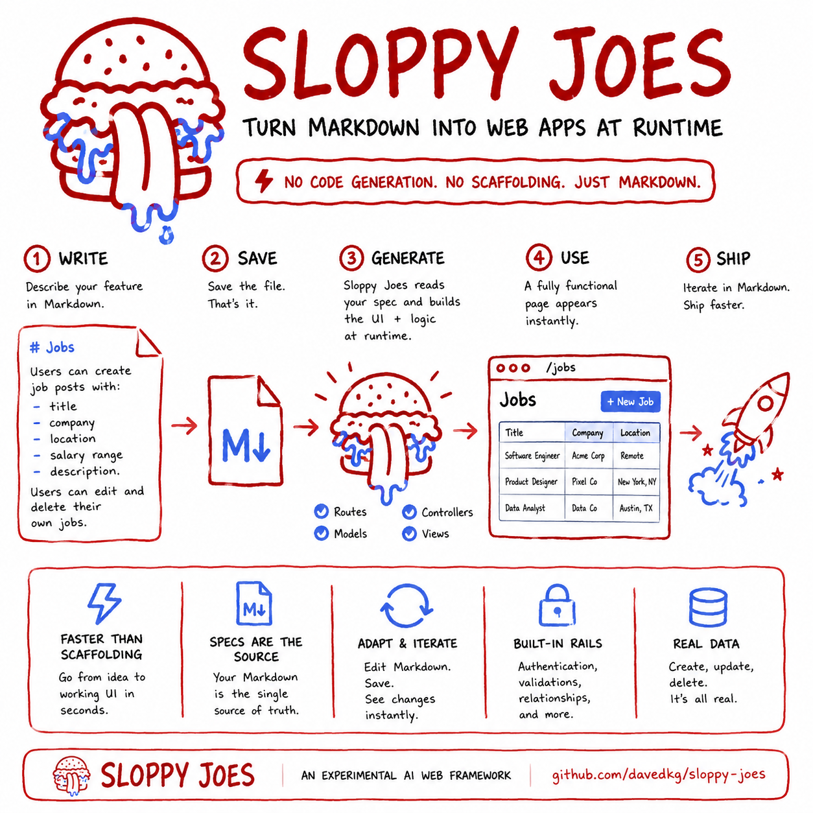

<p align="center">
  
</p>

# Sloppy Joes

**A weird experiment that turns Markdown requirements into working web pages at runtime.**

You describe what an app should do in plain Markdown — its features, data, and user stories — and on
every visit Claude generates the actual page from that description. No hand-written HTML, no build
step, no templates. (Under the hood it's a small framework; you just never write the pages yourself.)

See [`REQUIREMENTS.md`](./REQUIREMENTS.md) for the concept and [`STRUCTURE.md`](./STRUCTURE.md) for
how an app's files are organized.

## Prerequisites

- **Node.js 20+** and npm
- An **Anthropic API key** (the page generator calls Claude)
- macOS/Linux build tools for the native SQLite driver (`better-sqlite3`). On macOS this means the
  **Xcode Command Line Tools** — if `npm install` fails to build it, run `xcode-select --install`
  and reinstall.

## Setup

```bash
# 1. Install dependencies
npm install

# 2. Add your Anthropic API key (create a .env file at the repo root — it is gitignored)
echo "ANTHROPIC_API_KEY=sk-ant-..." > .env

# 3. Run the dev server (hot-reloading, no build step)
npm run dev
```

Then open **http://localhost:3000** — the home page lists the app's features. Two ship as examples:

- **todos** — a flat list: create, complete/uncomplete, delete (`features/todos.md`).
- **posts** — a blog with comments: each post is a card with its own nested comments and comment
  form, showing a parent→child relationship (`features/posts.md`).

Each visit generates the page live from that feature's Markdown.

## How it works

- `GET /:feature` reads the app's Markdown (`features/` + `config/`) and asks Claude to generate a
  **structure-only** page; the shell themes it with Pico.css for a consistent look.
- A feature's `models` are parsed for **entities and relationships**: a child entity that references
  a parent (e.g. a `Comment` with a `postId`) renders as parent cards with nested child lists.
- Generated forms POST to `/:feature/_action`; the framework persists the change to **SQLite** and
  uses **Turbo Streams** to update the page in place (no full reload).
- Pages only expose the **actions a feature's stories declare** (e.g. no delete button unless the
  feature says "delete a …"). Deletes prompt for confirmation before they run.

## Project layout

```
src/                 # the framework (server, generator, schema, db, rendering)
features/            # the app: what it does (Markdown)
config/              # the app: data store + design choices
REQUIREMENTS.md  STRUCTURE.md   # docs
```

## Commands

| Command | What it does |
|---------|--------------|
| `npm run dev` | Hot-reloading dev server on :3000 (serves the app at the repo root) |
| `npm run start` | Same, without file watching |
| `npm run typecheck` | `tsc --noEmit` |

## Configuration

- **API key** — `ANTHROPIC_API_KEY` (in `.env` or the environment). Required.
- **Model** — `SLOPPY_MODEL` (default: Claude Haiku 4.5).
- **Data store** — chosen in the app's `config/data.md` (`driver` + `path`); SQLite is the only
  implemented driver. Override the path with `SLOPPY_DB`.
- **Design** — chosen in the app's `config/design.md` (Pico.css by default).

## Run a different app

An "app" is just a directory containing `features/` and `config/`. Point the framework at it:

```bash
SLOPPY_APP_DIR=path/to/your-app npm run start
```

## Share it (optional)

Expose your local server with [ngrok](https://ngrok.com):

```bash
ngrok http 3000
```
